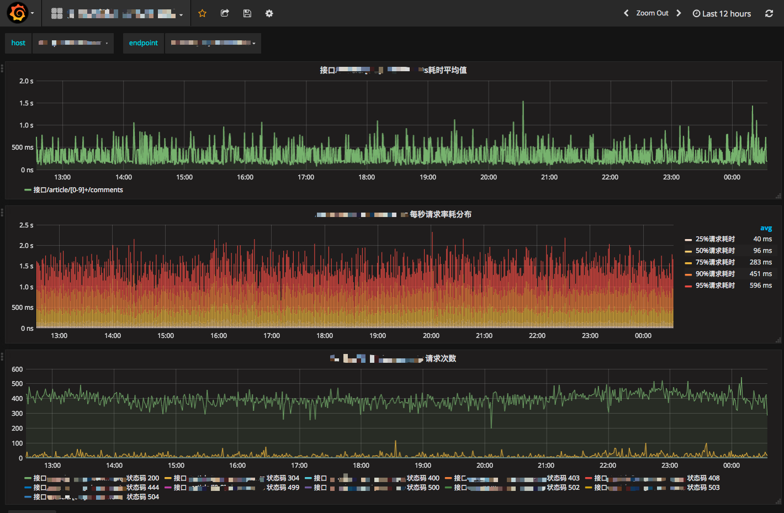

# lua-nginx-prometheus
这是一个监控Nginx流量的扩展程序.

## 介绍
基于Openresty和Prometheus、Consul、Grafana设计的，实现了针对域名和Endpoint级别的流量统计，使用Consul做服务发现、KV存储，Grafana做性能图展示。

最终展现图



### 主要实现流程

POST Json 注册服务 -> Consul Service <- Prometheus -> 定时抓取 http指标接口 Nginx

POST KV 提交Endpoint -> Consul KV Service <- Nginx 定时更新需要监控的Endpoint

Grafana 读取 -> Prometheus

### 优点

* 基本实现自动化集中配置，各种接口使用非常简单
* 通过Prometheus提供了非常丰富的查询维度，例如（域名、Endpoint、状态码、协议类型、method），当然还可以非常简单地添加更多。
* Grafana图表功能强大，非常直观地查看各个服务的状态和发现异常。

## 安装和使用说明

本项目是基于Openresty开发，所以事先安装好Openresty，这个非常简单。

安装Consul，这是基于golang开发的服务自动发现工具，详细查看官方文档。`https://www.consul.io/`

安装Prometheus，这是一个时序数据库和监控工具，性能和存储十分可靠，把Prometheus配置发现服务使用Consul。官方文档：`https://prometheus.io/docs/operating/configuration/#<consul_sd_config>`

安装Grafana。`https://grafana.com/`

### 安装 本扩展程序

克隆 lua-nginx-prometheus 仓库到Openresty服务器上。

克隆依赖Prometheus [nginx-lua-prometheus](https://github.com/knyar/nginx-lua-prometheus) 仓库到服务器上。

克隆依赖Consul [lua-resty-consul](https://github.com/hamishforbes/lua-resty-consul) 仓库到服务器上。

把lua-nginx-prometheus仓库中的 counter.conf文件复制到Openresty目录下的nginx/conf/conf.d目录内。

### 编辑 counter.conf 文件

```conf
lua_package_path "/Users/zl/Work/Counter/nginx-lua-prometheus/?.lua;;/Users/zl/Work/Counter/lua-resty-consul/lib/resty/?.lua;;/Users/zl/Work/Counter/lib/?.lua;;";
```

修改lua_package_path参数，把 lua-nginx-prometheus、nginx-lua-prometheus、lua-resty-consul三个目录位置指定，目录下一定是包含 ?.lua。

```
    consul_host = "<Your consul host ip>"
    consul_port = <Your consul port>
```

把consul的地址和端口替换上。

```
server {
    listen 9145;
    allow 127.0.0.1;
    deny all;
    access_log off;
    location /metrics {
        content_by_lua 'prometheus:collect()';
    }
}
```

添加allow 允许指定ip访问 指标接口。

启动Openresty后，试试 `http://<ip>:9145/metrics` 

### 配置 Prometheus 服务发现功能

详细参考这个文档

`https://prometheus.io/docs/operating/configuration/#<consul_sd_config>`

完成后，通过Consul 的 http API进行注册服务。

```
curl -X PUT -d @test.json http://<ip>:<port>/v1/agent/service/register
``` 

```json
{
  "ID": <定义唯一的ID>,
  "Name": "对应prometheus consul_sd_config",
  "Tags": [
    ""
  ],
  "Address": <Openresty地址>,
  "Port": 9145
}
```

注销服务

```
curl http://<ip>:<port>/v1/agent/service/deregister/<ID>
```

### 配置 Consul KV存储

增加域名和对应的Endpoint

```
curl --request PUT --data @test.json http://<ip>:<port>/v1/kv/domain/<api.qq.com>/routers
```
数组

```json
[
"/users/[0-9]+/followers/",
"/users/[0-9]+/",
"/users/[0-9]+/comments/",
"/news"
]
```

### 配置Grafana 到 Prometheus上读取数据

详细文档参考 `https://prometheus.io/docs/visualization/grafana/`


### 创建图表


